# LATIHAN & TUGAS

## RUN SIMPLE DOCKER CONTAINER
### Langkah 1
>Clone Image dari github
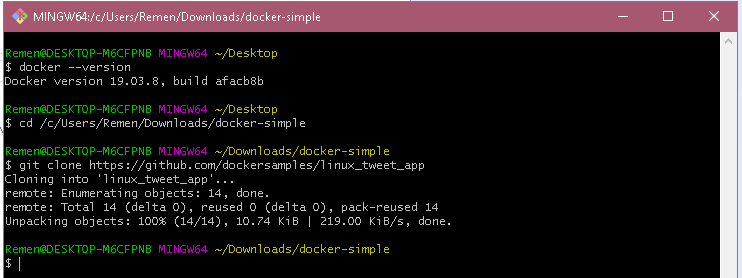

### Langkah 2
>Menjalankan docker container 
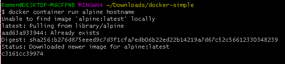

### Langkah 3
>Tampilan run container
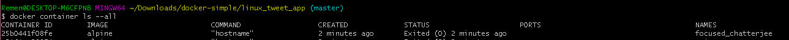

### Langkah 4
>menjalankan container berdasarkan versi Linux yang berbeda dari yang dijalankan pada host Docker
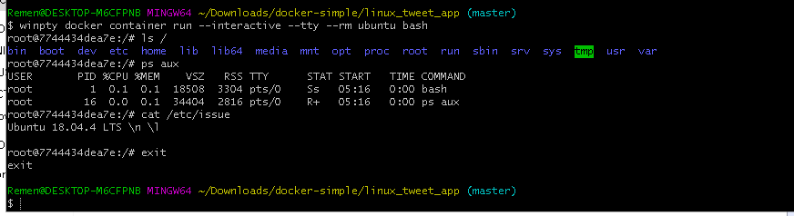
>Melihat versi host VM (Linux Ubuntu 18.0)

### Langkah 5
>Jalankan container MySQL baru
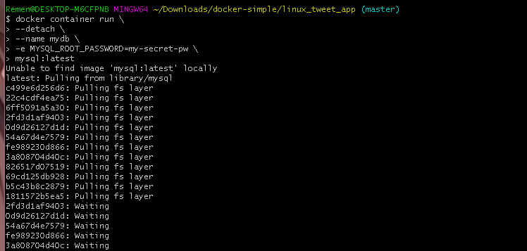

### Langkah 6
>Daftar running containers
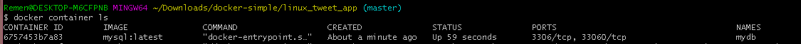

### Langkah 7
>memeriksa apa yang terjadi di Container dengan menggunakan beberapa perintah Docker bawaan
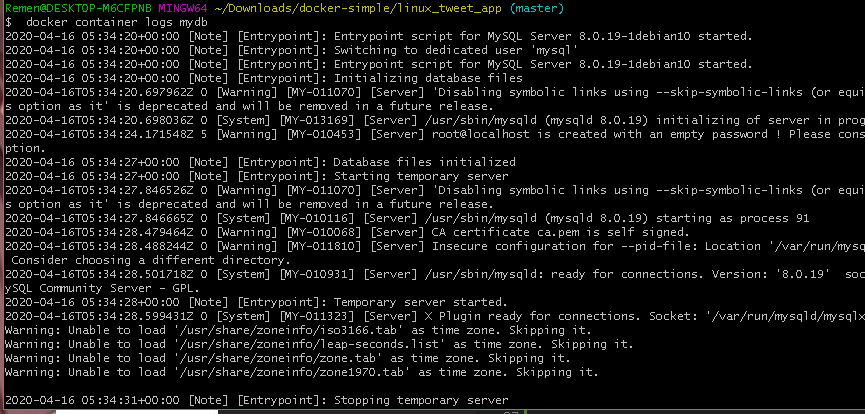

### Langkah 8
>melihat daemon MySQL (mysqld) berjalan di container
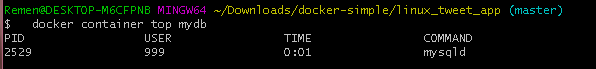

### Langkah 9
>Daftar versi MySQL menggunakan docker kontainer exec. kita dapat melihat versi linux pada gambar
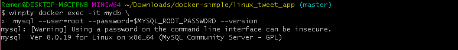

### Langkah 10
>Dapat juga menggunakan perintah ini (yg diatas lebih simple)
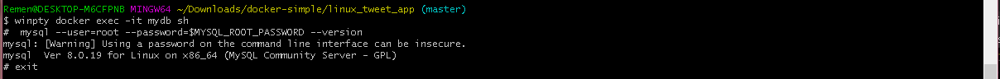
 
 

##  PACKAGE DAN MENJALANKAN CUSTOM APP DARI DOCKER
### Langkah 11
>

### Langkah 12
>
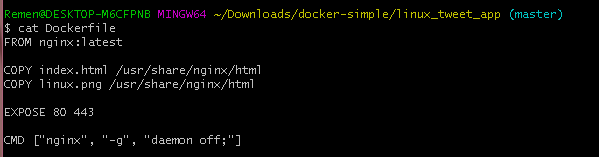

### Langkah 13
>
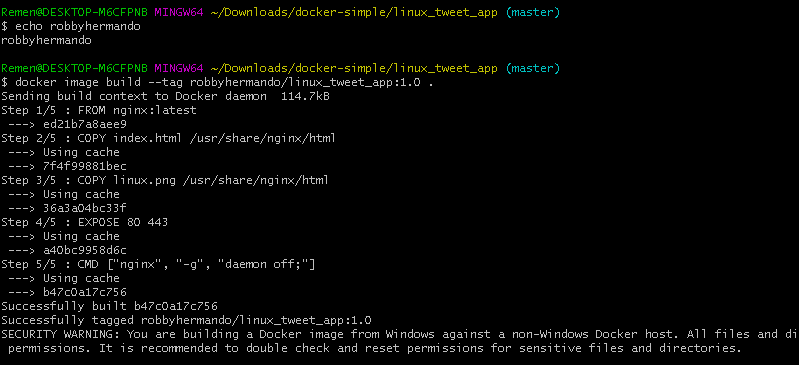

### Langkah 14
>
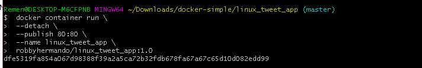

### Langkah 15
>Hasil dari container yang telah di jalankan 
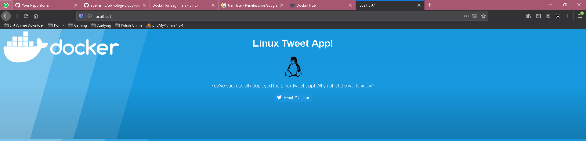

### Langkah 16
>Mematikan dan menghapus container yg berjalan
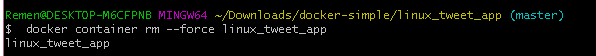
 
 

## MODIFIKASI WEBSITE YANG BERJALAN
### Langkah 17
>Menjalankan container dengan menambah perintah -mount
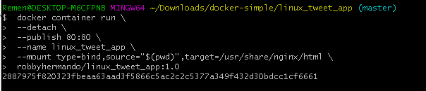

### Langkah 18
>Meng-copy index.html baru dengan yang lama
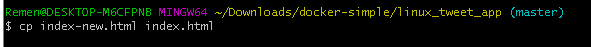

### Langkah 19
>Matikan container, jalankan, dan matikan kembali container
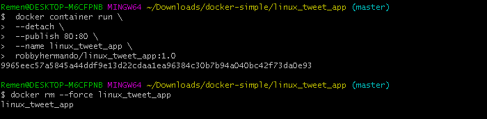

### Langkah 20
>Membuild image baru dengan versi 2.0 dari linux_tweet_app
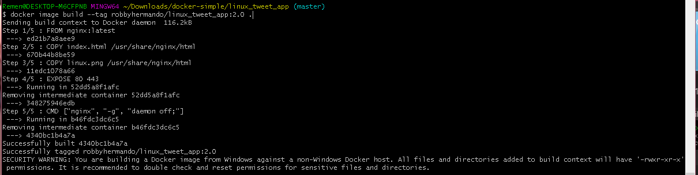

### Langkah 21
>Melihat image yang ada dalam sistem telah tertambah
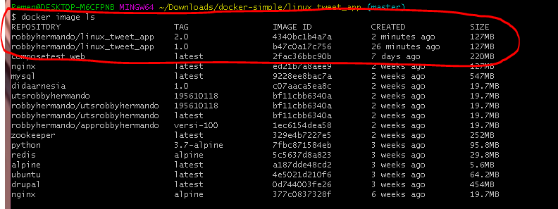

### Langkah 22
>jalankan image container linux tweet 2.0
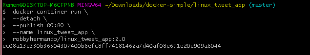

### Langkah 23
>Hasil run dari container linux tweet 2.0 (beda warna dengan versi 1)
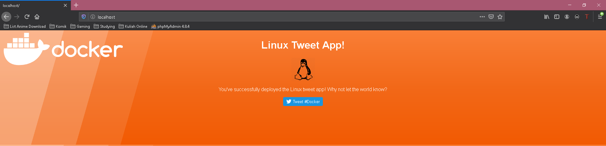

### Langkah 24
>Jalankan container linux tweet 1.0 bersamaan dengan 2.0 tapi dengan mengganti nama old_linux_tweet dan mengganti port dengan 8080, karena port 80 sudah di gunakan oleh versi 2.0 dan tidak dapat menggunakan 2 container dalam 1 port  
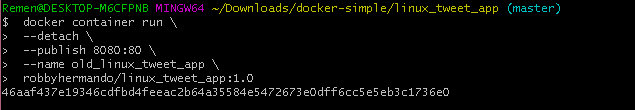

### Langkah 25
>Saat keduanya dijalankan 
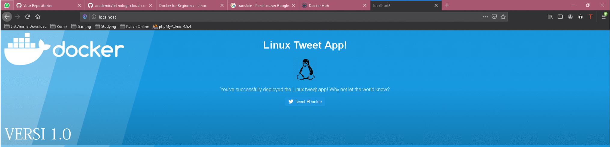
 
 

## PUSH IMAGE KE DOCKER HUB/DOCKER REPOSITORY
### Langkah 26
>ist dari docker host kita berdasarkan nama dockerid
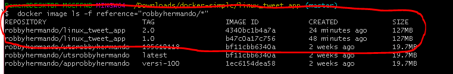

### Langkah 27
>login docker
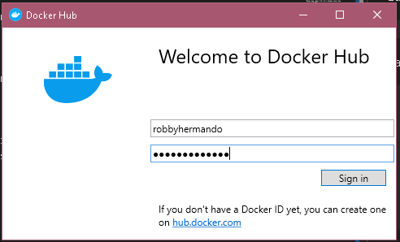

### Langkah 28
>push image linux_tweet versi 1.0
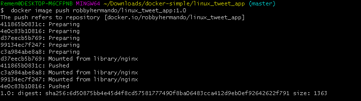

### Langkah 29
>push image linux_tweet versi 2.0
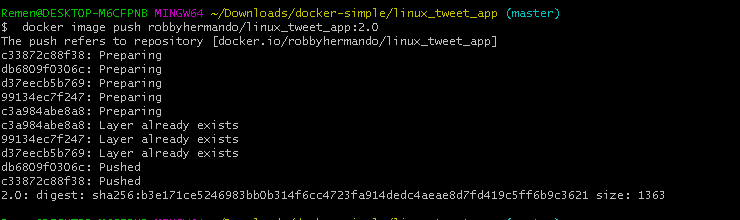

### Langkah 30
>Buka Repositori dockerhub, dan cek app linux_tweet_app akan ada 2 versi tags yang telah di push
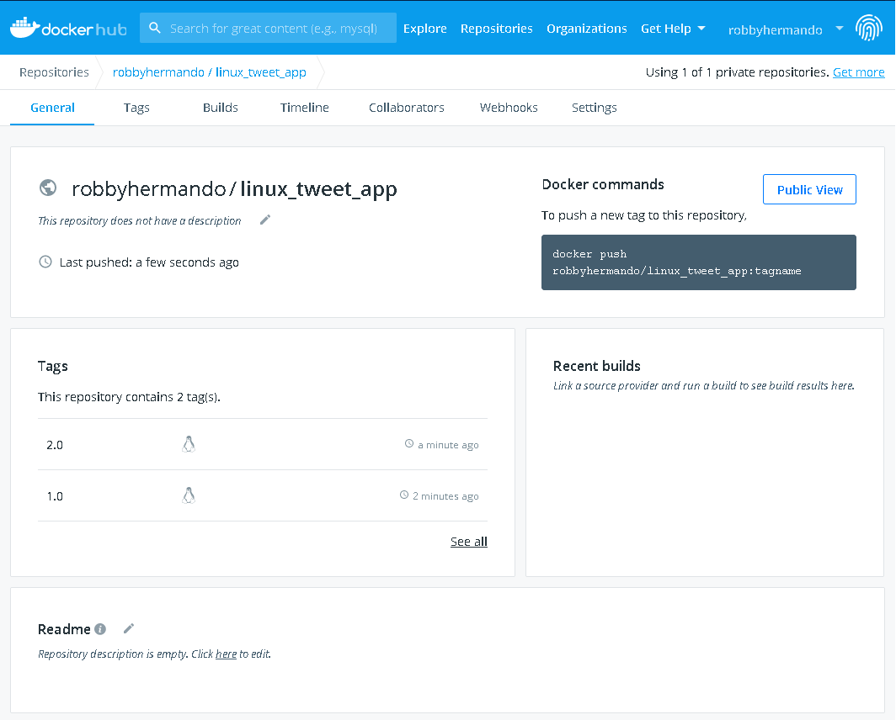

# SELESAI
