# LATIHAN & TUGAS

## SECTION 1 - NETWORKING BASIC
### LANGKAH 1
>Daftar perintah docker
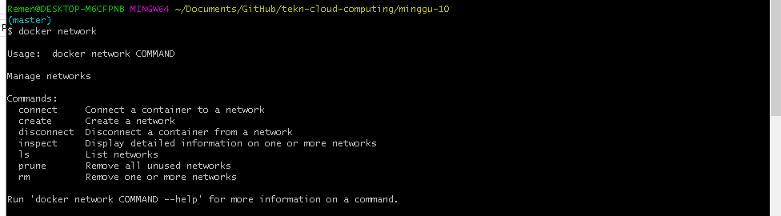

### LANGKAH 2
>Daftar Network
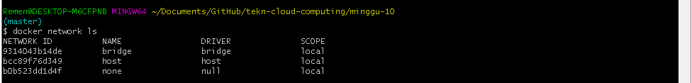

### LANGKAH 3
>Melihat configurasi detail dari network
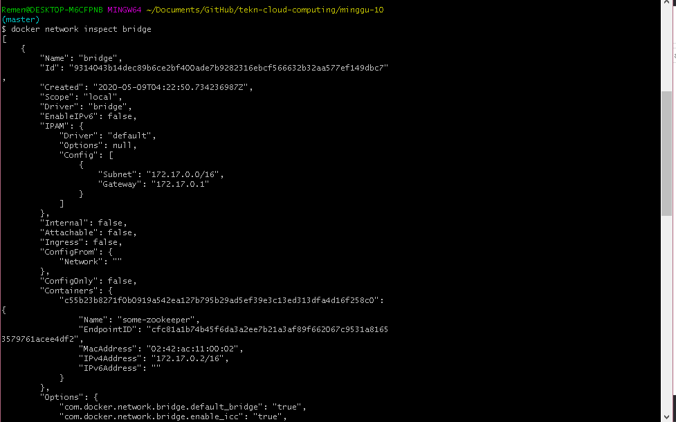

### LANGKAH 4
>Melihat Info docker yang terpasang di plugin
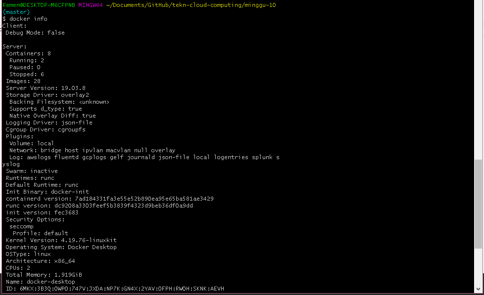

## SECTION 2 - Brige Networking
### LANGKAH 1
>Daftar network, dan bridge adalah host dari network yang saling berkoneksi dengan network lain
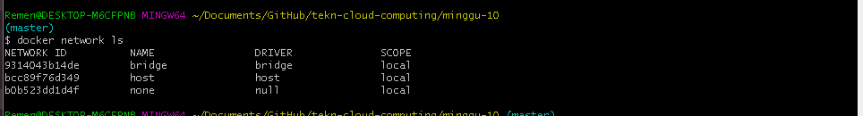

>instal "sudo apt-get install bridge-utils"
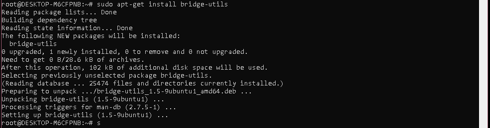

>menampilkan bridge
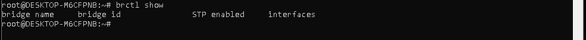

### LANGKAH 2
>membuat container baru
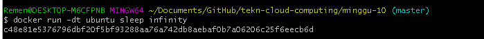

>melihat docker yang berjalan
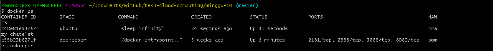

>inspect bridge network
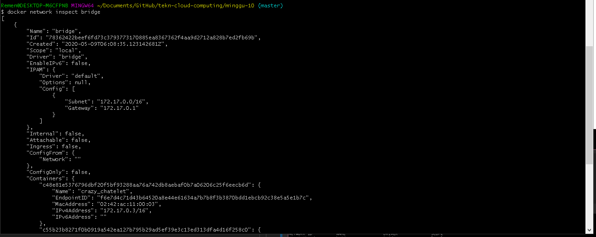

### LANGKAH 3
>inspect bridge network

>check ping c5
 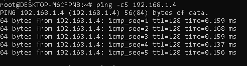

>melihat run container
 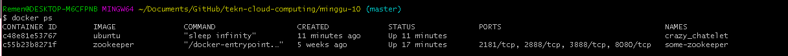